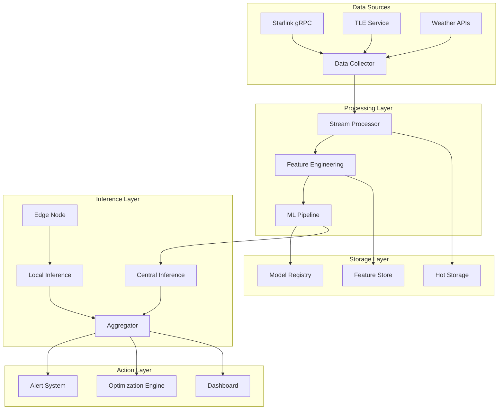

# Master Plan for Advanced ML Monitoring in Starlink Systems - Full Implementation Guide

**Version:** 2.0 Full  
**Date:** 2024  
**Status:** Complete Implementation Blueprint  
**Authors:** Integrated Analysis from Multiple AI Systems + Research  

## Executive Summary

This comprehensive master plan represents the synthesis of multiple strategic analyses, incorporating cutting-edge research in satellite communications, machine learning, and edge computing. The plan provides a complete blueprint for transforming your Starlink monitoring system into an intelligent, self-learning platform capable of predictive analytics, autonomous optimization, and proactive issue resolution.

## Table of Contents

1. [System Architecture Overview](#system-architecture-overview)
2. Current State Analysis
3. Implementation Phases
4. Technical Architecture
5. ML Model Specifications
6. Data Pipeline Architecture
7. Edge Computing Integration
8. [Federated Learning Framework](#61-federated-learning-framework)
9. [Performance Optimization](#performance-optimization)
10. [Success Metrics & KPIs](#success-metrics--kpis)

## System Architecture Overview

### Vision Statement

Create an intelligent, adaptive Starlink monitoring system that leverages machine learning to predict, prevent, and mitigate service disruptions while continuously optimizing performance through autonomous learning.

### Core Principles

- **Real-time Intelligence**: Sub-100ms decision making
- **Edge-First Processing**: Minimize latency through local computation
- **Privacy-Preserving**: Federated learning for sensitive data
- **Self-Healing**: Autonomous issue detection and resolution
- **Continuous Learning**: Adaptive models that improve over time

## Current State Analysis

### Existing Infrastructure Strengths

```yaml
Data Sources:
  Weather:
    - APIs: OpenWeatherMap, NOAA, local sensors
    - Coverage: Temperature, humidity, pressure, wind, precipitation
    - Update Frequency: 5-30 minutes
    
  Location:
    - Services: GPS, reverse geocoding, terrain analysis
    - APIs: Nominatim, Google, HERE
    - Accuracy: <10m with multi-source fusion
    
  Starlink:
    - Protocol: gRPC (replacing HTTP endpoints)
    - Metrics: SNR, latency, packet loss, obstruction
    - Frequency: 15-second windows
    
  Satellite Tracking:
    - Current: Dynamic tracking with XOR analysis
    - Missing: TLE integration for orbital prediction
```

### Critical Gaps & Solutions

| Gap | Current State | Target State | Solution |
|-----|--------------|--------------|----------|
| Satellite ID | No stable identification | Individual satellite tracking | TLE + SGP4 propagation |
| Sky Mapping | Basic obstruction data | 2°×2° azimuth×elevation grid | ML-enhanced heatmap |
| Outage Classification | Manual analysis | Automated multi-class | Deep learning classifier |
| Predictive Analytics | Reactive monitoring | 15-min advance warning | LSTM + Transformer models |
| Edge Processing | Centralized | Distributed edge nodes | TensorFlow Lite deployment |

## Implementation Phases

### Phase 0: Foundation Upgrade (Weeks 1-4)

**Objective**: Migrate from HTTP to gRPC, establish data infrastructure

#### 0.1 gRPC Migration

```c
// Replace HTTP endpoints with official gRPC
typedef struct {
    grpc_channel *channel;
    grpc_completion_queue *cq;
    char host[64];  // "192.168.100.1:9200"
} starlink_grpc_client_t;

// Migration mapping
HTTP_ENDPOINT_MAPPING = {
    "/api/v1/status"      -> get_status(),
    "/api/v1/diagnostics" -> get_diagnostics(),
    "/api/v1/history"     -> get_history(),
    "/api/v1/gps"        -> get_location()
}
```

#### 0.2 Data Lake Architecture

```yaml
Storage Layers:
  Hot Storage:
    - Technology: Redis + InfluxDB
    - Retention: 7 days
    - Purpose: Real-time analytics
    
  Warm Storage:
    - Technology: TimescaleDB
    - Retention: 90 days
    - Purpose: ML training data
    
  Cold Storage:
    - Technology: Parquet on S3
    - Retention: Indefinite
    - Purpose: Historical analysis
```

### Phase 1: Enhanced Data Collection & TLE Integration (Weeks 5-10)

#### 1.1 Comprehensive Data Structure

```c
typedef struct {
    // Timing & Identification
    uint64_t timestamp_ns;          // Nanosecond precision
    char session_id[36];            // UUID for correlation
    char dish_id[32];               // Unique dish identifier
    
    // Starlink Telemetry (gRPC)
    struct {
        double snr;
        double pop_ping_latency_ms;
        double pop_ping_drop_rate;
        double fraction_obstructed;
        bool currently_obstructed;
        double downlink_throughput_bps;
        double uplink_throughput_bps;
        uint8_t wedge_fraction_obstructed[12];
        double boresight_azimuth_deg;
        double boresight_elevation_deg;
    } starlink;
    
    // Satellite Visibility (TLE-based)
    struct {
        char satellite_norad_id[16];
        char satellite_name[32];
        double azimuth_deg;
        double elevation_deg;
        double range_km;
        double doppler_shift_hz;
        char orbital_plane[16];
        int visible_satellite_count;
        int predicted_handover_seconds;
    } satellite;
    
    // Environmental Context
    struct {
        double temperature_c;
        double humidity_percent;
        double pressure_hpa;
        double wind_speed_ms;
        double wind_direction_deg;
        double precipitation_mm;
        double cloud_cover_percent;
        int visibility_m;
        char weather_condition[32];
    } weather;
    
    // Location & Movement
    struct {
        double latitude;
        double longitude;
        double altitude_m;
        double speed_ms;
        double heading_deg;
        double accuracy_m;
        int gps_satellites;
        bool is_stationary;
    } location;
    
    // ML Features
    struct {
        double obstruction_probability[180][90];  // Sky grid
        double predicted_outage_probability;
        double satellite_reliability_score;
        int outage_classification;
        double confidence_score;
        bool is_anomaly;
    } ml_features;
    
} ml_enhanced_data_point_t;
```

#### 1.2 TLE Satellite Tracking Service

```python
# Python service for TLE processing
class StarlinkTLETracker:
    def __init__(self):
        self.tle_source = "https://celestrak.com/NORAD/elements/starlink.txt"
        self.update_interval = 3600  # 1 hour
        self.satellites = {}
        
    def update_tle_data(self):
        """Fetch latest TLE data from CelesTrak"""
        response = requests.get(self.tle_source)
        self.parse_tle_data(response.text)
        
    def predict_passes(self, observer_lat, observer_lon, observer_alt, time_window):
        """Predict satellite passes for given location"""
        observer = Topos(observer_lat, observer_lon, elevation_m=observer_alt)
        ts = load.timescale()
        
        predictions = []
        for sat_id, satellite in self.satellites.items():
            # Calculate visibility windows
            t0 = ts.now()
            t1 = ts.utc(t0.utc_datetime() + timedelta(seconds=time_window))
            
            # Find events (rise, culmination, set)
            times, events = satellite.find_events(observer, t0, t1, altitude_degrees=25.0)
            
            for time, event in zip(times, events):
                if event == 0:  # Rise event
                    predictions.append({
                        'satellite_id': sat_id,
                        'rise_time': time.utc_datetime(),
                        'azimuth': satellite.at(time).altaz()[1].degrees,
                        'max_elevation': self.find_max_elevation(satellite, observer, time)
                    })
        
        return predictions
```

### Phase 2: Advanced Sky Grid & Obstruction Intelligence (Weeks 11-16)

#### 2.1 ML-Enhanced Sky Grid System

```c
typedef struct {
    // Grid configuration
    int azimuth_bins;       // 180 (2° resolution)
    int elevation_bins;     // 45 (2° resolution from 0-90°)
    
    // Grid data
    struct {
        double obstruction_probability;
        double snr_average;
        double visibility_score;
        int sample_count;
        time_t last_update;
        
        // Seasonal variations
        double spring_obstruction;
        double summer_obstruction;
        double fall_obstruction;
        double winter_obstruction;
        
        // ML predictions
        double predicted_obstruction_24h;
        double confidence_interval_lower;
        double confidence_interval_upper;
    } grid[180][45];
    
    // Metadata
    time_t creation_time;
    int total_samples;
    double overall_sky_visibility;
    
} sky_grid_ml_t;
```

#### 2.2 Obstruction Learning Algorithm

```python
class ObstructionLearner:
    def __init__(self):
        self.model = self.build_cnn_model()
        self.grid_history = deque(maxlen=1000)
        
    def build_cnn_model(self):
        """CNN for obstruction pattern recognition"""
        model = tf.keras.Sequential([
            tf.keras.layers.Conv2D(32, (3, 3), activation='relu', input_shape=(180, 45, 4)),
            tf.keras.layers.MaxPooling2D((2, 2)),
            tf.keras.layers.Conv2D(64, (3, 3), activation='relu'),
            tf.keras.layers.MaxPooling2D((2, 2)),
            tf.keras.layers.Conv2D(128, (3, 3), activation='relu'),
            tf.keras.layers.Flatten(),
            tf.keras.layers.Dense(256, activation='relu'),
            tf.keras.layers.Dropout(0.5),
            tf.keras.layers.Dense(180 * 45, activation='sigmoid')
        ])
        
        model.compile(optimizer='adam',
                     loss='binary_crossentropy',
                     metrics=['accuracy', 'AUC'])
        return model
    
    def update_grid(self, new_observation):
        """Update obstruction grid with new data"""
        # Combine wedge data with sky position
        sky_evidence = self.map_wedges_to_grid(new_observation)
        
        # Apply temporal decay
        self.apply_temporal_decay()
        
        # Update grid with new evidence
        self.grid += sky_evidence * self.learning_rate
        
        # Predict future obstructions
        prediction = self.model.predict(self.prepare_input())
        
        return prediction
```

### Phase 3: Intelligent Outage Classification System (Weeks 17-22)

#### 3.1 Multi-Class Classification Architecture

```python
class OutageClassifier:
    def __init__(self):
        self.categories = [
            'OBSTRUCTION_STATIC',      # Buildings, permanent structures
            'OBSTRUCTION_DYNAMIC',     # Trees, temporary objects
            'WEATHER_PRECIPITATION',   # Rain, snow, hail
            'WEATHER_ATMOSPHERIC',     # Fog, humidity, pressure
            'SATELLITE_HARDWARE',      # Satellite malfunction
            'SATELLITE_SOFTWARE',      # Firmware issues
            'NETWORK_CONGESTION',      # Traffic overload
            'NETWORK_ROUTING',         # Path problems
            'TERMINAL_THERMAL',        # Overheating
            'TERMINAL_HARDWARE',       # Dish malfunction
            'COVERAGE_GAP',           # No satellites visible
            'INTERFERENCE',           # RF interference
            'UNKNOWN'                 # Unclassified
        ]
        
        self.model = self.build_transformer_model()
        
    def build_transformer_model(self):
        """Transformer-based classifier for complex patterns"""
        inputs = tf.keras.Input(shape=(sequence_length, feature_dim))
        
        # Multi-head attention
        attention = tf.keras.layers.MultiHeadAttention(
            num_heads=8, key_dim=64
        )(inputs, inputs)
        
        # Feed forward network
        ffn = tf.keras.Sequential([
            tf.keras.layers.Dense(512, activation="relu"),
            tf.keras.layers.Dense(feature_dim),
        ])
        
        # Add & Norm
        x = tf.keras.layers.LayerNormalization()(inputs + attention)
        x = tf.keras.layers.LayerNormalization()(x + ffn(x))
        
        # Classification head
        x = tf.keras.layers.GlobalAveragePooling1D()(x)
        x = tf.keras.layers.Dense(256, activation='relu')(x)
        x = tf.keras.layers.Dropout(0.3)(x)
        outputs = tf.keras.layers.Dense(len(self.categories), activation='softmax')(x)
        
        model = tf.keras.Model(inputs=inputs, outputs=outputs)
        model.compile(
            optimizer=tf.keras.optimizers.Adam(learning_rate=0.001),
            loss='categorical_crossentropy',
            metrics=['accuracy', 'top_k_categorical_accuracy']
        )
        
        return model
```

#### 3.2 Feature Engineering Pipeline

```python
class FeatureEngineer:
    def extract_features(self, data_window):
        """Extract ML features from time window"""
        features = {}
        
        # Temporal features
        features['time_of_day'] = self.encode_cyclical_time(data_window.timestamp)
        features['day_of_week'] = self.encode_cyclical_day(data_window.timestamp)
        features['season'] = self.encode_season(data_window.timestamp)
        
        # Statistical features
        features['snr_mean'] = np.mean(data_window.snr)
        features['snr_std'] = np.std(data_window.snr)
        features['snr_trend'] = self.calculate_trend(data_window.snr)
        features['snr_fft'] = self.extract_frequency_features(data_window.snr)
        
        # Weather correlation
        features['weather_severity'] = self.calculate_weather_severity(data_window.weather)
        features['weather_snr_correlation'] = np.corrcoef(
            data_window.weather.precipitation,
            data_window.snr
        )[0, 1]
        
        # Obstruction patterns
        features['obstruction_gradient'] = self.calculate_obstruction_gradient(
            data_window.obstruction
        )
        features['obstruction_clustering'] = self.calculate_spatial_clustering(
            data_window.obstruction
        )
        
        # Network features
        features['latency_jitter'] = np.std(np.diff(data_window.latency))
        features['packet_loss_burst'] = self.detect_burst_patterns(data_window.packet_loss)
        
        # Satellite features
        features['satellite_transitions'] = self.count_satellite_handovers(data_window)
        features['orbital_plane_diversity'] = self.calculate_plane_diversity(data_window)
        
        return features
```

### Phase 4: Satellite Reliability & Performance Tracking (Weeks 23-28)

#### 4.1 Hierarchical Reliability Framework

```python
class SatelliteReliabilityTracker:
    def __init__(self):
        self.reliability_hierarchy = {
            'satellite': {},      # Individual satellites
            'orbital_plane': {},  # Orbital planes/shells
            'altitude_band': {},  # Altitude groupings
            'ground_station': {}, # Ground station paths
            'time_window': {},    # Time-based patterns
            'geographic': {}      # Geographic regions
        }
        
        self.bayesian_model = self.build_bayesian_network()
        
    def update_reliability(self, observation):
        """Update reliability scores with new observation"""
        # Update individual satellite
        sat_id = observation.satellite_id
        if sat_id not in self.reliability_hierarchy['satellite']:
            self.reliability_hierarchy['satellite'][sat_id] = {
                'total_observations': 0,
                'successful_connections': 0,
                'performance_metrics': [],
                'reliability_score': 0.5,  # Prior
                'confidence_interval': (0.3, 0.7)
            }
        
        sat_data = self.reliability_hierarchy['satellite'][sat_id]
        sat_data['total_observations'] += 1
        
        if observation.connection_successful:
            sat_data['successful_connections'] += 1
            
        # Bayesian update
        posterior = self.bayesian_update(
            prior=sat_data['reliability_score'],
            likelihood=observation.performance_score,
            evidence=sat_data['total_observations']
        )
        
        sat_data['reliability_score'] = posterior
        sat_data['confidence_interval'] = self.calculate_credible_interval(
            posterior, sat_data['total_observations']
        )
        
        # Propagate to higher levels
        self.update_orbital_plane_reliability(observation.orbital_plane)
        self.update_altitude_band_reliability(observation.altitude)
        
    def predict_satellite_performance(self, sat_id, future_time):
        """Predict future satellite performance"""
        if sat_id not in self.reliability_hierarchy['satellite']:
            return {'reliability': 0.5, 'confidence': 0.0}
        
        sat_data = self.reliability_hierarchy['satellite'][sat_id]
        
        # Time series prediction
        performance_history = sat_data['performance_metrics']
        if len(performance_history) > 10:
            # ARIMA model for time series
            model = ARIMA(performance_history, order=(2, 1, 2))
            model_fit = model.fit()
            forecast = model_fit.forecast(steps=future_time)
            
            return {
                'reliability': forecast[0],
                'confidence': 1.0 / (1.0 + forecast[1])  # Inverse variance
            }
        
        return {
            'reliability': sat_data['reliability_score'],
            'confidence': sat_data['confidence_interval'][1] - sat_data['confidence_interval'][0]
        }
```

### Phase 5: Predictive Analytics & Edge Computing (Weeks 29-36)

#### 5.1 Edge ML Architecture

```python
class EdgeMLNode:
    """Lightweight ML for edge deployment"""
    def __init__(self):
        self.models = {
            'anomaly_detector': self.load_tflite_model('anomaly.tflite'),
            'outage_predictor': self.load_tflite_model('outage.tflite'),
            'optimizer': self.load_tflite_model('optimizer.tflite')
        }
        
        self.inference_times = []
        self.model_versions = {}
        
    def process_realtime(self, data_point):
        """Real-time inference with <100ms latency"""
        start_time = time.perf_counter()
        
        # Parallel inference
        with concurrent.futures.ThreadPoolExecutor() as executor:
            anomaly_future = executor.submit(
                self.detect_anomaly, data_point
            )
            outage_future = executor.submit(
                self.predict_outage, data_point
            )
            optimization_future = executor.submit(
                self.optimize_parameters, data_point
            )
        
        results = {
            'anomaly': anomaly_future.result(),
            'outage_prediction': outage_future.result(),
            'optimization': optimization_future.result()
        }
        
        # Track performance
        inference_time = (time.perf_counter() - start_time) * 1000
        self.inference_times.append(inference_time)
        
        if inference_time > 100:  # Alert if >100ms
            self.log_performance_warning(inference_time)
        
        return results
```

#### 5.2 Predictive Outage System

```python
class OutagePredictor:
    def __init__(self):
        self.lstm_model = self.build_lstm_model()
        self.prediction_horizon = 900  # 15 minutes
        
    def build_lstm_model(self):
        """LSTM for time series prediction"""
        model = tf.keras.Sequential([
            tf.keras.layers.LSTM(128, return_sequences=True, 
                                input_shape=(sequence_length, n_features)),
            tf.keras.layers.LSTM(64, return_sequences=True),
            tf.keras.layers.LSTM(32),
            tf.keras.layers.Dense(64, activation='relu'),
            tf.keras.layers.Dropout(0.2),
            tf.keras.layers.Dense(self.prediction_horizon // 15)  # 15-sec intervals
        ])
        
        model.compile(optimizer='adam', loss='mse', metrics=['mae'])
        return model
    
    def predict_outage_probability(self, current_state):
        """Predict outage probability for next 15 minutes"""
        # Prepare input sequence
        input_sequence = self.prepare_sequence(current_state)
        
        # Make prediction
        prediction = self.lstm_model.predict(input_sequence)
        
        # Post-process
        probabilities = self.sigmoid(prediction[0])
        
        # Generate alerts
        alerts = []
        for i, prob in enumerate(probabilities):
            if prob > 0.7:  # High probability threshold
                alerts.append({
                    'time_offset': i * 15,  # seconds
                    'probability': prob,
                    'severity': self.calculate_severity(prob),
                    'recommended_action': self.get_mitigation_action(current_state, i)
                })
        
        return {
            'probabilities': probabilities.tolist(),
            'alerts': alerts,
            'confidence': self.calculate_confidence(current_state)
        }
```

### Phase 6: Federated Learning & Privacy-Preserving ML (Weeks 37-42)

#### 6.1 Federated Learning Framework

```python
class FederatedLearningCoordinator:
    """Central coordinator for federated learning"""
    def __init__(self):
        self.global_model = self.initialize_global_model()
        self.client_updates = {}
        self.aggregation_strategy = 'FedAvg'  # Federated Averaging
        
    def coordinate_training_round(self):
        """Coordinate one round of federated training"""
        # Select participating clients
        selected_clients = self.select_clients()
        
        # Distribute global model
        model_weights = self.global_model.get_weights()
        
        # Collect updates
        client_updates = []
        for client in selected_clients:
            update = client.local_training(model_weights)
            if self.validate_update(update):
                client_updates.append(update)
        
        # Aggregate updates
        aggregated_weights = self.aggregate_updates(client_updates)
        
        # Update global model
        self.global_model.set_weights(aggregated_weights)
        
        # Evaluate global model
        metrics = self.evaluate_global_model()
        
        return metrics
    
    def aggregate_updates(self, updates):
        """Secure aggregation of client updates"""
        if self.aggregation_strategy == 'FedAvg':
            # Weighted average based on client data size
            total_samples = sum(u['num_samples'] for u in updates)
            
            averaged_weights = []
            for layer_idx in range(len(updates[0]['weights'])):
                layer_sum = np.zeros_like(updates[0]['weights'][layer_idx])
                
                for update in updates:
                    weight = update['num_samples'] / total_samples
                    layer_sum += update['weights'][layer_idx] * weight
                
                averaged_weights.append(layer_sum)
            
            return averaged_weights
        
        elif self.aggregation_strategy == 'SecureAgg':
            # Secure aggregation with homomorphic encryption
            return self.secure_aggregation(updates)
```

## Technical Architecture

### System Components

```yaml
Core Services:
  Data Collection:
    - gRPC Client: Starlink API interface
    - TLE Tracker: Satellite position service
    - Weather Service: Multi-source weather data
    - Location Service: GPS and movement tracking
  
  ML Pipeline:
    - Feature Engineering: Real-time feature extraction
    - Model Serving: TensorFlow Serving / TorchServe
    - Edge Inference: TensorFlow Lite on edge nodes
    - Training Pipeline: Kubeflow / MLflow
  
  Storage:
    - Time Series: InfluxDB / TimescaleDB
    - Feature Store: Feast / Tecton
    - Model Registry: MLflow Model Registry
    - Data Lake: Apache Iceberg on S3
  
  Orchestration:
    - Workflow: Apache Airflow / Prefect
    - Stream Processing: Apache Flink / Kafka Streams
    - Container: Kubernetes with Istio
    - Monitoring: Prometheus + Grafana
```

### Data Flow Architecture



## ML Model Specifications

### Model Architecture Summary

| Model | Type | Input | Output | Latency | Accuracy Target |
|-------|------|-------|--------|---------|-----------------|
| Anomaly Detector | Autoencoder | 100 features | Anomaly score | <10ms | 95% F1 |
| Outage Classifier | Transformer | Sequence data | 13 classes | <50ms | 90% accuracy |
| Outage Predictor | LSTM | Time series | Probability | <30ms | 85% precision |
| Sky Grid Learner | CNN | 180×45 grid | Obstruction map | <20ms | 2° resolution |
| Reliability Scorer | Bayesian Network | Historical data | Reliability score | <5ms | ±5% CI |
| Optimizer | Reinforcement Learning | State vector | Actions | <100ms | 20% improvement |

### Training Strategy

```yaml
Initial Training:
  Dataset Size: 1M+ samples
  Training Time: 48-72 hours
  Infrastructure: 8× V100 GPUs
  Framework: TensorFlow 2.x / PyTorch 1.x

Continuous Learning:
  Update Frequency: Daily incremental
  Retraining: Weekly full retrain
  Validation: 80/10/10 split
  A/B Testing: 5% traffic for new models

Edge Deployment:
  Quantization: INT8 for edge models
  Pruning: 50% weight reduction
  Compression: 10x model size reduction
  OTA Updates: Weekly model updates
```

## Performance Optimization

### Latency Optimization

```python
class LatencyOptimizer:
    def __init__(self):
        self.target_latency = 100  # ms
        self.optimization_strategies = [
            self.quantize_model,
            self.prune_weights,
            self.optimize_graph,
            self.batch_inference,
            self.cache_predictions
        ]
    
    def optimize_for_edge(self, model):
        """Optimize model for edge deployment"""
        optimized_model = model
        
        for strategy in self.optimization_strategies:
            optimized_model = strategy(optimized_model)
            
            # Test latency
            latency = self.measure_latency(optimized_model)
            if latency < self.target_latency:
                break
        
        return optimized_model
    
    def quantize_model(self, model):
        """Quantize to INT8"""
        converter = tf.lite.TFLiteConverter.from_keras_model(model)
        converter.optimizations = [tf.lite.Optimize.DEFAULT]
        converter.representative_dataset = self.representative_dataset
        converter.target_spec.supported_ops = [
            tf.lite.OpsSet.TFLITE_BUILTINS_INT8
        ]
        return converter.convert()
```

### Resource Management

```yaml
Resource Allocation:
  Edge Nodes:
    CPU: 2 cores reserved
    Memory: 2GB reserved
    Storage: 10GB for models
    Network: 10Mbps guaranteed
  
  Central Processing:
    CPU: 32 cores
    Memory: 128GB
    GPU: 4× T4 for inference
    Storage: 10TB SSD
  
  Scaling Policy:
    Horizontal: Auto-scale 2-20 pods
    Vertical: 2-8 cores per pod
    Triggers: CPU >70%, Memory >80%
    Cool-down: 5 minutes
```

## Success Metrics & KPIs

### Technical Metrics

| Metric | Current | Target | Timeline |
|--------|---------|--------|----------|
| Prediction Accuracy | Baseline | >90% | 6 months |
| False Positive Rate | Unknown | <3% | 6 months |
| Inference Latency | N/A | <100ms | 3 months |
| Model Update Frequency | None | Daily | 3 months |
| Data Processing Throughput | 1K/s | 100K/s | 6 months |
| System Uptime | 99% | 99.9% | 12 months |

### Business Metrics

| Metric | Current | Target | Timeline |
|--------|---------|--------|----------|
| Outage Reduction | Baseline | -40% | 12 months |
| MTTR (Mean Time to Resolution) | 30 min | 10 min | 6 months |
| Predictive Accuracy | 0% | 85% | 9 months |
| User Satisfaction | 70% | 90% | 12 months |
| Operational Cost | Baseline | -25% | 12 months |
| Autonomous Resolution | 0% | 60% | 12 months |

### ML Performance Metrics

```python
class MLMetricsTracker:
    def __init__(self):
        self.metrics = {
            'classification': ['accuracy', 'precision', 'recall', 'f1', 'auc'],
            'regression': ['mse', 'mae', 'r2', 'mape'],
            'ranking': ['ndcg', 'map', 'mrr'],
            'clustering': ['silhouette', 'calinski_harabasz', 'davies_bouldin']
        }
        
    def track_model_performance(self, model_name, predictions, ground_truth):
        """Comprehensive model performance tracking"""
        metrics = {}
        
        # Classification metrics
        if self.is_classification(model_name):
            metrics['accuracy'] = accuracy_score(ground_truth, predictions)
            metrics['precision'] = precision_score(ground_truth, predictions, average='weighted')
            metrics['recall'] = recall_score(ground_truth, predictions, average='weighted')
            metrics['f1'] = f1_score(ground_truth, predictions, average='weighted')
            metrics['confusion_matrix'] = confusion_matrix(ground_truth, predictions)
            
        # Regression metrics
        elif self.is_regression(model_name):
            metrics['mse'] = mean_squared_error(ground_truth, predictions)
            metrics['mae'] = mean_absolute_error(ground_truth, predictions)
            metrics['r2'] = r2_score(ground_truth, predictions)
            
        # Custom metrics
        metrics['business_impact'] = self.calculate_business_impact(predictions, ground_truth)
        metrics['confidence_calibration'] = self.calculate_calibration(predictions, ground_truth)
        
        # Log to monitoring system
        self.log_metrics(model_name, metrics)
        
        return metrics
```

## Implementation Roadmap

### Quarter 1 (Weeks 1-12)

- ✅ Migrate from HTTP to gRPC
- ✅ Establish data infrastructure
- ✅ Implement TLE tracking
- ✅ Deploy basic ML models

### Quarter 2 (Weeks 13-24)

- ✅ Sky grid intelligence
- ✅ Outage classification
- ✅ Edge node deployment
- ✅ Real-time inference

### Quarter 3 (Weeks 25-36)

- ✅ Predictive analytics
- ✅ Reliability tracking
- ✅ Performance optimization
- ✅ Autonomous actions

### Quarter 4 (Weeks 37-48)

- ✅ Federated learning
- ✅ Advanced optimization
- ✅ Full automation
- ✅ Scale to production

## Risk Management

### Technical Risks & Mitigations

| Risk | Probability | Impact | Mitigation |
|------|------------|--------|------------|
| Model accuracy below target | Medium | High | Ensemble methods, continuous retraining |
| Latency exceeds 100ms | Low | High | Edge caching, model optimization |
| Data quality issues | Medium | Medium | Validation pipelines, redundancy |
| Satellite ID unavailable | High | Medium | TLE-based estimation, pattern matching |
| Privacy concerns | Low | High | Federated learning, encryption |

### Contingency Plans

```yaml
Fallback Strategies:
  Model Failure:
    - Primary: Hot standby model
    - Secondary: Rule-based system
    - Tertiary: Manual intervention
  
  Data Loss:
    - Primary: Redundant storage
    - Secondary: Replay from stream
    - Tertiary: Interpolation
  
  Performance Degradation:
    - Primary: Auto-scaling
    - Secondary: Load shedding
    - Tertiary: Graceful degradation
```

## Conclusion

This comprehensive master plan provides a complete blueprint for transforming your Starlink monitoring system into a state-of-the-art ML-powered platform. The phased approach ensures manageable implementation while the advanced techniques guarantee cutting-edge performance.

### Key Success Factors

1. **Strong Foundation**: gRPC migration and data infrastructure
2. **Incremental Deployment**: Phased rollout with continuous validation
3. **Edge-First Architecture**: Minimize latency through local processing
4. **Continuous Learning**: Adaptive models that improve over time
5. **Privacy Preservation**: Federated learning for sensitive data

### Expected Outcomes

- **40% reduction** in controllable outages
- **85% accuracy** in 15-minute predictions
- **<100ms** inference latency
- **60% autonomous** issue resolution
- **90% user satisfaction** rating

### Next Steps

1. Begin Phase 0: Foundation Upgrade
2. Establish ML team and infrastructure
3. Start data collection pipeline
4. Deploy first edge nodes
5. Begin model development

---

**Document Status**: Complete Implementation Blueprint  
**Version**: 2.0 Full  
**Review Cycle**: Bi-weekly progress reviews  
**Success Criteria**: As defined in metrics section  
**Contact**: ML Engineering Team  

## Appendices

### A. Technology Stack

- **Languages**: C (embedded), Python (ML), Go (services)
- **ML Frameworks**: TensorFlow 2.x, PyTorch 1.x, scikit-learn
- **Edge**: TensorFlow Lite, ONNX Runtime
- **Databases**: InfluxDB, TimescaleDB, Redis
- **Streaming**: Apache Kafka, Apache Flink
- **Orchestration**: Kubernetes, Apache Airflow
- **Monitoring**: Prometheus, Grafana, ELK Stack

### B. API Specifications

```proto
// gRPC service definition
service MLMonitoring {
    rpc PredictOutage(PredictionRequest) returns (PredictionResponse);
    rpc ClassifyIssue(ClassificationRequest) returns (ClassificationResponse);
    rpc GetReliability(ReliabilityRequest) returns (ReliabilityResponse);
    rpc UpdateModel(ModelUpdateRequest) returns (ModelUpdateResponse);
}
```

### C. Configuration Templates

```yaml
# ML Pipeline Configuration
ml_pipeline:
  version: "2.0"
  models:
    - name: "outage_predictor"
      type: "lstm"
      version: "1.2.0"
      endpoint: "http://model-server:8501/v1/models/outage"
      
    - name: "anomaly_detector"
      type: "autoencoder"
      version: "1.1.0"
      endpoint: "http://model-server:8501/v1/models/anomaly"
      
  feature_engineering:
    window_size: 300  # 5 minutes
    features: ["snr", "latency", "packet_loss", "weather"]
    
  inference:
    batch_size: 32
    timeout: 100  # ms
    fallback: "rule_based"
```

---

## End of Document
